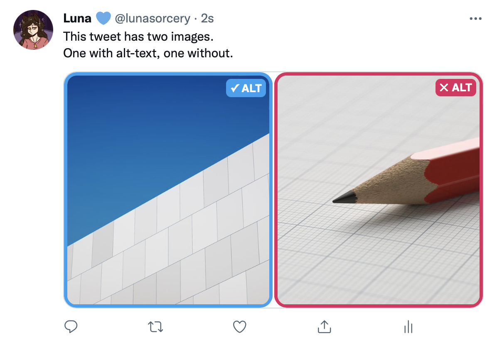
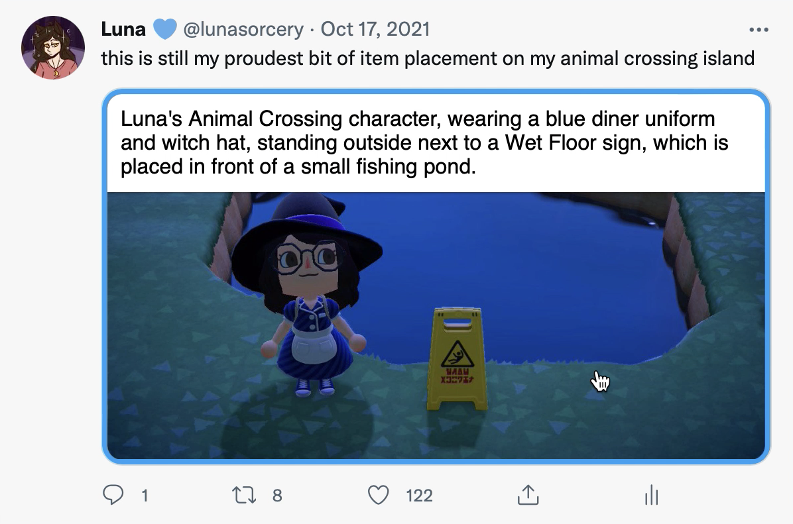
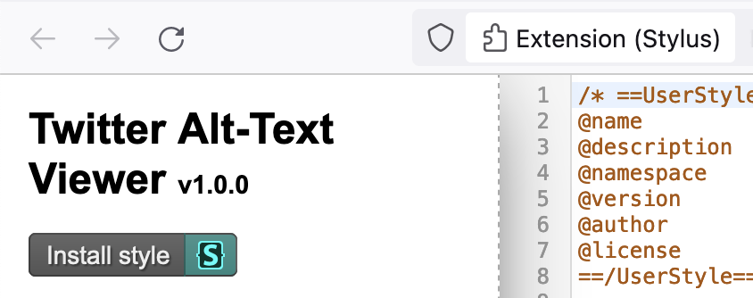
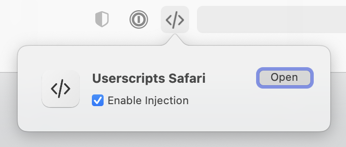
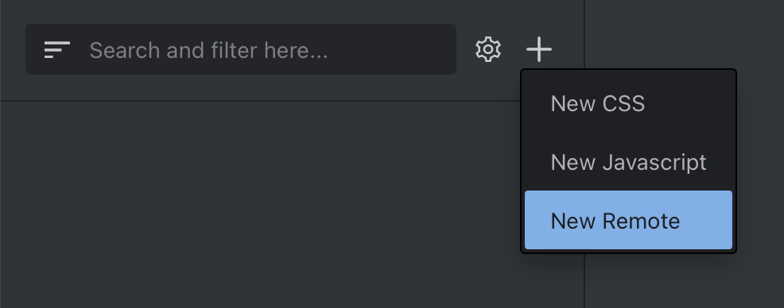

# Twitter Alt-Text Viewer

A set of custom CSS rules to make alt-text visible on Twitter's desktop web interface.

## Features

#### Clear indicators for whether an image has alt-text or not:



#### Visible alt-text on mouse-over:


## Installation

### Step 1: Install a browser extension to inject custom CSS

There are several available, but I'm personally partial to [Stylus](https://github.com/openstyles/stylus) (Chrome/Firefox/Opera) and [UserScripts](https://apps.apple.com/us/app/userscripts/id1463298887) (Safari).

There's also the popular **Stylish**, but there are [compelling reasons against using it](https://robertheaton.com/2018/08/16/stylish-is-back-and-you-still-shouldnt-use-it/) — Stylus was created as a safer alternative after that fiasco.

### Step 2: Install the custom CSS

#### Using Stylus

[](https://raw.githubusercontent.com/lunasorcery/twitter-alt-text-viewer/main/twitter-alt-text-viewer.user.css)

With Stylus installed, click the above button, and the extension will open a new tab prompting you to add the style:



Then, click the "Install style" button on the left, and you're all set!

#### Using UserScripts (Safari)

Click the UserScripts icon in the window bar, and press "Open" to launch its settings panel.



Click the "+" button, then "New Remote".



When prompted for a URL, paste in the following:

```
https://raw.githubusercontent.com/lunasorcery/twitter-alt-text-viewer/main/twitter-alt-text-viewer.user.css
```

Unfortunately, there are some small compatibility issues (see #1) and the style won't quite work out-of-the-box — you'll need to make some manual tweaks:

You'll need to add `@include  https://twitter.com/*` to the block at the top of the file. You'll also need to remove the `@-moz-document` line, as well as the very last `}` in the file. Once you're done, don't forget to hit "Save" the bottom-right, and you should be all set!
