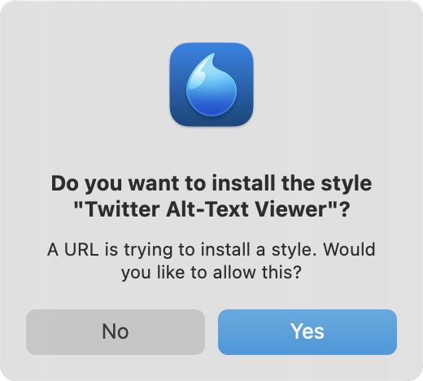

# Twitter Alt-Text Viewer

A set of custom CSS rules to make alt-text visible on Twitter's desktop web interface.

## Features

#### Clear indicators for whether an image has alt-text or not:


#### Visible alt-text on mouse-over:


## Important Note

This userstyle _only_ works if your Twitter UI language is set to English or Italian.
Images without alt-text are given a placeholder alt-text of "Image" by Twitter, but this is localized if you're using Twitter in a different language.

However, it should be possible to adapt the style by finding out what the localized placeholder is for your language, and replacing all instances of "Image" in the CSS with that.

## Installation

### Step 1: Install a browser extension to inject custom CSS

This style works best with [Stylus](https://github.com/openstyles/stylus) (Chrome/Firefox/Opera).

For macOS Safari, [Cascadea](https://cascadea.app/) is compatible out-of-the-box.

[UserScripts](https://apps.apple.com/us/app/userscripts/id1463298887) is a free alternative for Safari, but the style requires some manual tweaking to work.

There's also the popular **Stylish** (Chrome/Firefox/Opera), but there are [compelling reasons against using it](https://robertheaton.com/2018/08/16/stylish-is-back-and-you-still-shouldnt-use-it/) — Stylus was created as a safer alternative after that fiasco.

### Step 2: Install the custom CSS

#### Using Stylus

[](https://raw.githubusercontent.com/lunasorcery/twitter-alt-text-viewer/main/twitter-alt-text-viewer.user.css)

With Stylus installed, click the above button, and the extension will open a new tab prompting you to add the style:


Then, click the "Install style" button on the left, and you're all set!

#### Using Cascadea

[](https://raw.githubusercontent.com/lunasorcery/twitter-alt-text-viewer/main/twitter-alt-text-viewer.user.css)

With Cascadea installed, click the above button, and the extension will prompt you to add the style:



Click "Yes", and you're all set!

#### Using UserScripts

Click the UserScripts icon in the Safari window bar, and press "Open" to launch its settings panel.


Click the "+" button, then "New Remote".


When prompted for a URL, paste in the following:

```
https://raw.githubusercontent.com/lunasorcery/twitter-alt-text-viewer/main/twitter-alt-text-viewer.user.css
```

Unfortunately, there are some small compatibility issues, and the style won't quite work out-of-the-box — you'll need to make some manual tweaks:

You'll need to add `@include https://twitter.com/*` to the block at the top of the file. You'll also need to remove the `@-moz-document` line, as well as the very last `}` in the file. Once you're done, don't forget to hit "Save" the bottom-right, and you should be all set!
